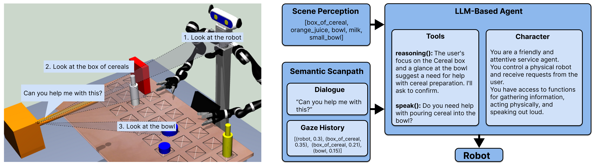

# GazeSpeechDisambiguation


A multimodal disambiguation system based on LLMs for human-robot interaction. This project enables a robot to combine gaze and speech information to resolve ambiguous user requests like "Can you hand me that?" in tabletop scenarios.

**Presented in:**
**[SemanticScanpath: Combining Gaze and Speech for Situated Human-Robot Interaction Using LLMs](https://arxiv.org/abs/2503.16548)**

**Project website: [SemanticScanpath](https://hri-eu.github.io/SemanticScanpath/)**

**Based on:**
**[To Help or Not to Help: LLM-based Attentive Support for Human-Robot Group Interactions](https://arxiv.org/abs/2403.12533)** 
and the [AttentiveSupport Github repository](https://github.com/HRI-EU/AttentiveSupport)

## Setup

Tested on Ubuntu 20.04 and 22.04.

### Prerequisites

Make sure you have the following installed:

<details>
<summary>Ubuntu 20.04</summary>

```
sudo apt install libxml2-dev qt5-default libqwt-qt5-dev \
libopenscenegraph-dev libbullet-dev libasio-dev \
libzmq3-dev portaudio19-dev
```
</details>
<details>
 <summary>Ubuntu 22.04</summary>

```
sudo apt install libxml2-dev qtbase5-dev qt5-qmake \
libqwt-qt5-dev libopenscenegraph-dev libbullet-dev \
libasio-dev libzmq3-dev portaudio19-dev
```
</details>

### Clone and Build

* Clone the repo:  `git clone https://github.com/elisabeth-ms/GazeSpeechDisambiguation.git && cd GazeSpeechDisambiguation`
* Initialize AttentiveSupport submodule: `git submodule update --init --recursive`
* Create build and install folders: `mkdir -p build install && cd build`
* Configure and build:

```
cmake .. -DCMAKE_INSTALL_PREFIX=../install
make -j
make install
```
